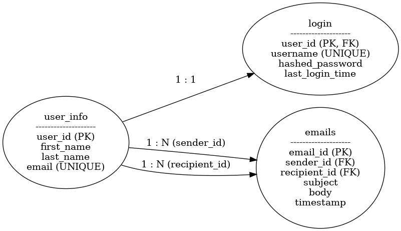

Name - Dhyan Aaran
Student id - B00943107

## Database Setup

Use `db_dump.sql` to recreate the database:

1. Open phpMyAdmin
2. Create a new database named `email_app`
3. Go to the Import tab
4. Upload `db_dump.sql` and click Go

## Description

In this project, we created a basic email web application using PHP and MySQL. Users can log in securely, view their inbox and sent messages, and send new emails to other users. We used sessions for login, cookies to show last login time, and the fetch API for async communication between the frontend and backend. All data is stored in a MySQL database, and the user interface is built with Bootstrap for a clean and simple design.

## How to Run

1. Start Apache and MySQL using **XAMPP** or **MAMP**.
2. Place this project in your `htdocs/` folder.
3. Go to [http://localhost/A4/templates/login.html](http://localhost/A4/templates/login.html)
4. Use credentials:
   - **Email:** `john@example.com`
   - **Password:** `password123`

---

## 🗃️ Database Setup

1. Create a database named `email_app`.
2. Import `db_dump.sql` via **phpMyAdmin**.
3. Make sure `user_info`, `login`, and `emails` tables are created with sample data.

---

## 📌 Features Implemented

### ✅ User Story 1: Authentication

- Secure login using `password_hash()` and `password_verify()`
- Session-based authentication
- Logout clears session
- Last login time displayed via cookie

### ✅ User Story 2: Inbox & Sent

- Emails shown via `fetch()` from PHP API
- Inbox auto-refreshes every 60 seconds

### ✅ User Story 3: Compose Email

- Compose form with recipient, subject, and message
- Emails stored in DB and shown in inbox/sent

### ✅ User Story 4: API-like Endpoints

- Clean separation of frontend and backend logic
- All responses are JSON

### ✅ User Story 5: Usability

- Bootstrap UI for responsive layout
- Reusable header with nav links and logout
- Clear error/status messages

---

## 📊 ERD Diagram

---

## 👨‍💻 Developer Notes

- Built using **pure PHP** (no frameworks)
- Database: **MySQL**
- Styling: **Bootstrap 5**
- Data transfer: `fetch()` with `JSON`
- Tested in: Google Chrome

---
